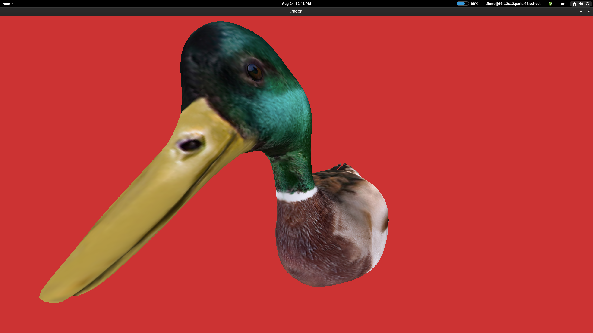
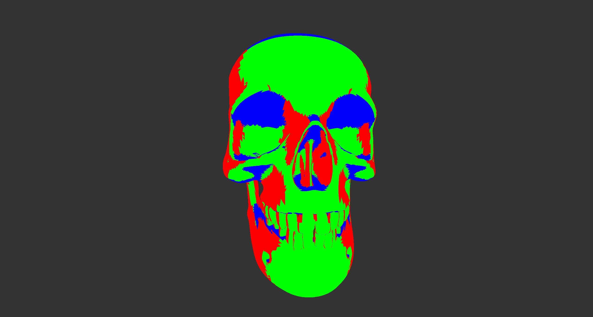

*This project has been created as part of the 42 curriculum by tfiette.*

**Description**

This project aims to create a program that allows to load a .obj file and display the resulting 3D object - with a limited usage of external libraries (GLAD and GLFW). It is the first project of the graphic branch, and an introduction to using the GPU and the graphic pipeline.

I chose to use C++ with OpenGL and to parse texture from the .tga extension for simplicity. I also chose to apply triangulation to the faces, to use EBOs, and to parse texture/normal coordinates from the file to expand my knowledge.

This project is fulfilling all the requirements from the subject (and more), but it is far from a complete 3D renderer.

*The project directory tree should be self-explanatory:*

-├── include\
-│   ├── core\
-│   ├── loader\
-│   ├── math\
-│   ├── mesh\
-│   └── render\
-├── Makefile\
-├── README.MD\
-├── resources\
-│   ├── models\
-│   └── textures\
-├── SCOP\
-├── src\
-│   ├── core\
-│   ├── input\
-│   ├── loader\
-│   ├── math\
-│   ├── mesh\
-│   ├── render\
-│   └── shader\
-└── third-party\
-    └── glad

  
  

**Instructions**

*usage exemple*

- `make`
- `./SCOP resources/models/duck.obj resources/textures/duck.tga`

-*the model file has to be a .obj*
-*the texture file is optional, and has to be a .tga*

*controls :*

*movements (qwerty)*
- *← ↑ → ↓ & mouse scroll* : moving the object
- *a d / w s / q e* : rotating the object
- *- +* : increase/decrease movement sensitivity
- *\** : toggle sensitivity on rotation

*display*
- *'* : texture toggle
- *\\* : untextured display as grey faces / normals toggle

**Resources**

The main resource I used is this excellent OpenGL tutorial : https://learnopengl.com/book/book_pdf.pdf

More resources :
- https://www.opengl-tutorial.org/intermediate-tutorials/tutorial-9-vbo-indexing/
- https://stackoverflow.com/questions/53245632/general-formula-for-perspective-projection-matrix
- https://www.geeksforgeeks.org/maths/rotation-matrix/

**AI usage**

Since this is a learning project, I tried to use AI in a way that allowed me to make my own mistakes and to learn.
Basically I designed and coded without it, and used it afterward to point weaknesses in architecture, naming or logic.
I did use it to generate code once (a hashing function), and this is documented in the file.

**Disclaimer**

Since this is a school project, I used resources that are not mine. The models and textures are not made by me.